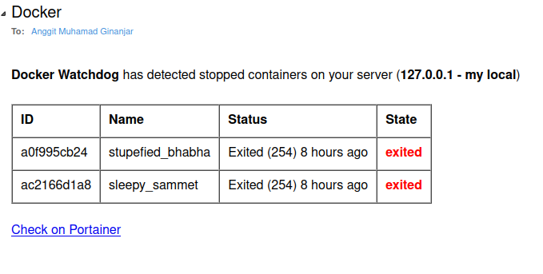
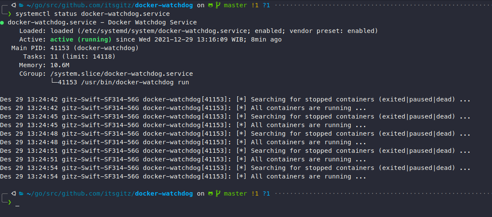

# Docker Watchdog

Docker Watchdog is a simple `Go` application that is used for detects all stopped containers that have `exited`, `paused`, or `dead` state/status.
It uses [list containers endpoints](https://docs.docker.com/engine/api/v1.41/#operation/ContainerList) from
[Docker Engine API](https://docs.docker.com/engine/api/v1.41/#).
The watcher will gather all docker containers information repeatedly every 3 seconds using `go Ticker` function.
If there are stopped containers detected in our system or cloud infrastructure, `Docker Watchdog` will send an email alert to Developer or System Administrator.

# Getting Started

## Prerequisite
* Go Version: `go1.17.2 linux/amd64`
* Docker Engine: `20.10+`

## Installation

**Note**: The installation only tested on Linux-Like operating system (linux distro), but you can even use `docker-watchdog` by building it from the go source code for Windows and MacOS support.

### A. With `make` command
1. Clone this repository

```
$ git clone https://github.com/itsgitz/docker-watchdog.git
```

2. In the root project directory, type:

```
$ sudo make install
```

3. After installation, the `docker-watchdog` application will run as linux service. But, we have to specify configuration value
on `/opt/.docker-watchdog.yaml`
4. For configuration example you can see on [example/conf/.docker-watchdog.yaml](./example/conf/.docker-watchdog.example.yaml)

### B. Build from source
1. Use `go build` command

```
$ go build
```

2. The default executable output named `docker-watchdog`

## Usage

### A. Run with systemctl (Linux)
1. If you installing `docker-watchdog` with `make` command, the application will run automatically as `systemd` service or Linux service.
2. Docker Watchdog creates the default configuration file on `/opt/` directory called `.docker-watchdog.yaml`. It's strongly
recommend to edit the configuration file on `/opt/.docker-watchdog.yaml` before run the `docker-watchdog` service.
3. After you specify the configuration value on configuration file, you have to restart the `docker-watchdog` service.

```
$ sudo systemctl restart docker-watchdog
```

4. Make sure that the configuration value is correct. See [example configuration](./example/conf/.docker-watchdog.example.yaml)

### B. Run with go executable (Windows, MacOS, Linux)

1. If you run the `docker-watchdog` on MacOS or Windows, make sure to specify your own configuration file with option `--config` 

```
# MacOS
$ ./docker-watchdog run --config my-docker-watchdog.yaml
```

```
# Windows
> docker-watchdog.exe run --config my-docker-watchdog.yaml
```

2. You can even run the same command on Linux if you build the `docker-watchdog` from source code (with `go`)

### C. Gmail Settings

If you use Gmail, you have to allow **Less Secure App** on security setting (`Google Manage Account > Security > Less secure app access`)

### D. Example Output

1. Email:



2. Docker Watchdog Service



# Todo

* Finish installation script for linux
* Add notification using Telegram Bot

# Contributor

Anggit M Ginanjar <anggit.ginanjar@outlook.com>
